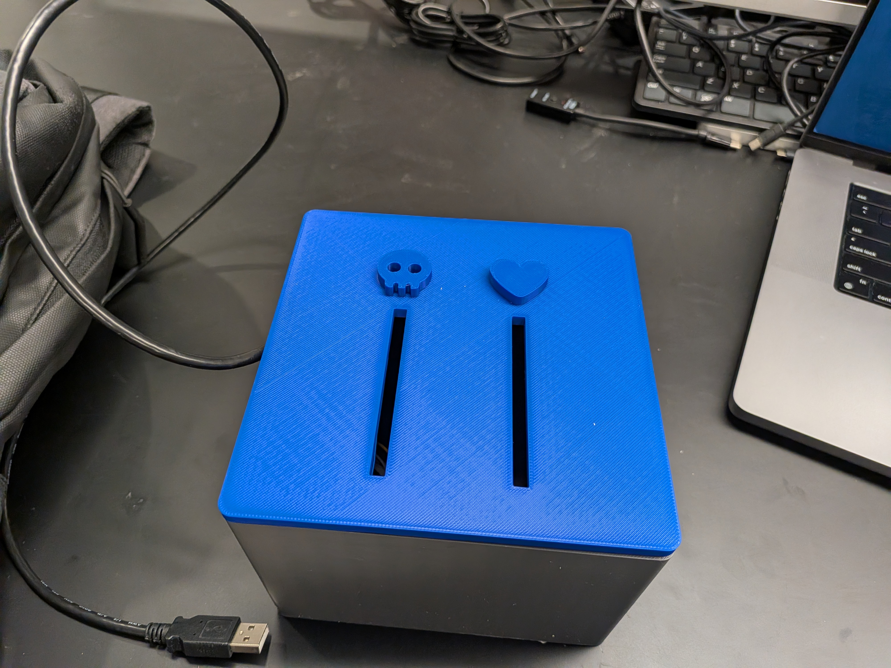
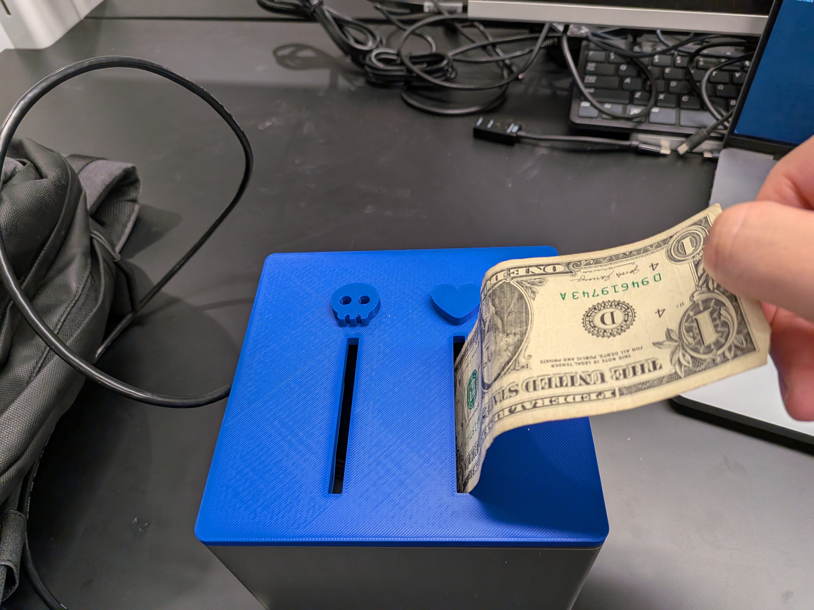
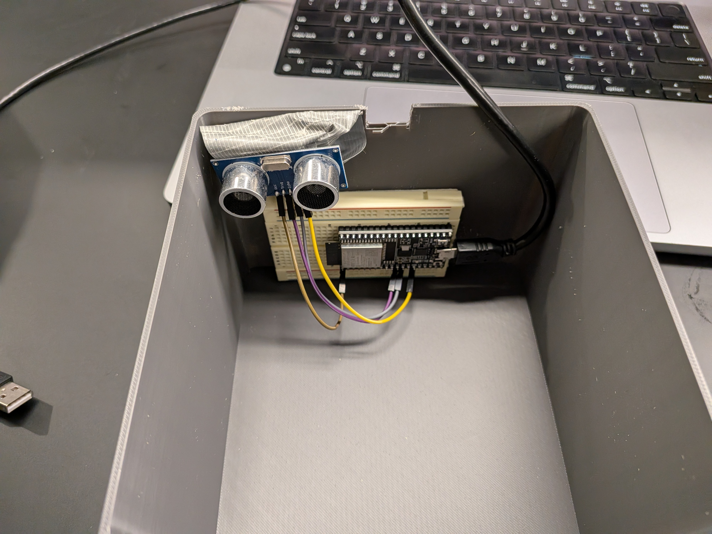

# judgment-zoo

Will you be naughty or nice? Project for Yale CPSC 3340: Creative Embedded Systems

[**Video demo**](./gallery/demo.mp4)

## Enclosure
3D print `cad/Box.stl` and `cad/Lid.stl`.

## Microcontroller

Wire an ESP32 to an Ultrasonic distance sensor. Program the code `microcontroller/microcontroller.ino`, after changing your WiFi SSID and wiring pins.

## Minecraft Plugin

The Minecraft component requires a [Bukkit server](https://dev.bukkit.org/).

Build the plugin in `/plugin` with the provided Maven script. Drag the generated `.jar` file into your server's `plugins` directory. 

You can use the world that I built for this project by copying `/world/world` into your Minecraft server directory.
